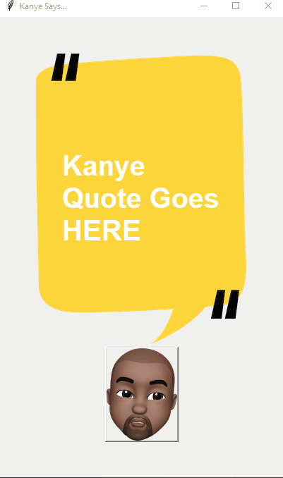
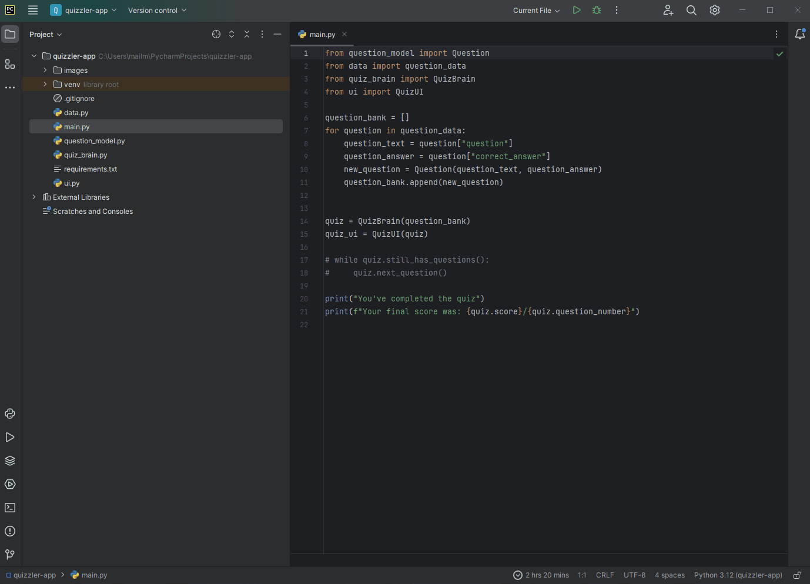
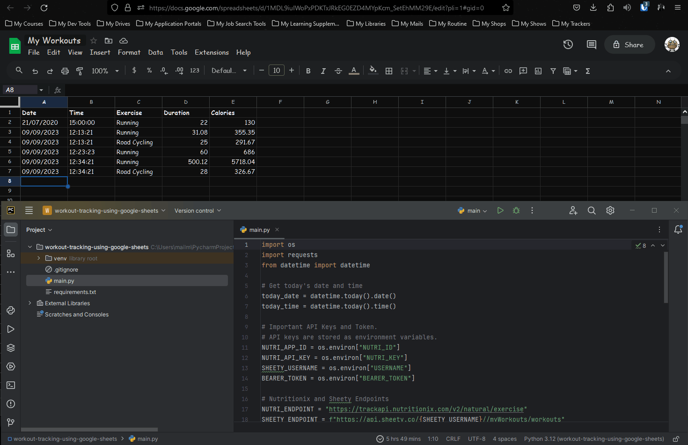
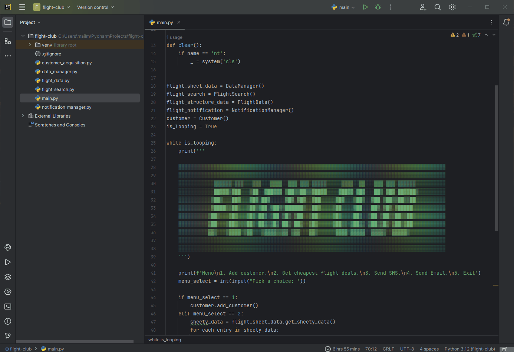

# Python HTTP Requests and APIs Projects

These python HTTP Requests and APIs projects are built in correspondence with " [100 Days of Code - The Complete Python Pro Bootcamp](https://www.udemy.com/course/100-days-of-code/) " course. This course was taught by London's App Brewery top instructor Angela Yang. 

Each project has been built from scratch with minimal to no assistance. 

### Day 033 - Kanye Quotes App

This project simulates the Kanye Quotes App. Use the requests module to get kanye quotes from the [kanye.rest](https://kanye.rest/) API. Fetch the quotes from the newly acquired JSON response and store it. Fetch and display a random quote on button click. 

For a live version, go [here](https://replit.com/@grandeurkoe/kanye-quotes-app?v=1) .

### Day 034 - Quizzler App

This project simulates the Quizzler App. Use the requests module to get quiz data from the [Open Trivia Database](https://opentdb.com/api_config.php) API. Fetch the quiz data from the newly acquired JSON response and store it. Click on ✅ button if you think the correct answer is "True". Click on ❌  button if you think the correct answer is "False". Turn question card **green** if the user guessed correctly else turn **red**. On reaching the end of the quiz, print user score on the console.

For a live version, go [here](https://replit.com/@grandeurkoe/quizzler-app?v=1) .

### Day 035 - Rain Alert

### Day 036 - Stock Trading News Alert

### Day 037 - Habit Tracker

This project tracks daily cycling using the [Pixela](https://docs.pixe.la/) API. 

Features included:
- Create a Pixela user account.
- Create a graph.
- Get cycling data in kilometers as user input. Post a pixel on graph.
- Update a pixel on graph.
- Delete a pixel on graph.

For a live version, go [here](https://replit.com/@grandeurkoe/habit-tracker?v=1) .

### Day 038 - Workout Tracker

This project simulates a workout tracker. Get today's exercise entry in natural language form i.e., "30 minutes yoga". Use the requests module to make a POST request to the [Nutritionix v2.0](https://www.nutritionix.com/business/api) API by passing today's exercise data as API parameters. The Nutritionix API will parse today's exercise entry and calculate the calories burned. Store the newly acquired JSON response from the Nutritionix API. Furthermore, use the requests module to make a POST request to the [Sheety](https://sheety.co/) API by passing each exercise entry from the stored JSON data as API parameter. The Sheety API will push each exercise entry onto a new row in the "workouts" sheet (part of "My Workout" spreadsheet). Finally, display each exercise entry onto the console.

For a live version, go [here](https://replit.com/@grandeurkoe/workout-tracking-using-google-sheets?v=1) .

### Day 039 - Flight Deal Finder

### Day 040 - Flight Club

This project simulates the [Flight Club](https://jacksflightclub.com/). 

Features included:
- Add customers - Get customer's first name, last name and email as user input. Use the requests module to make a POST request to the [Sheety](https://sheety.co/) API by passing customer's data as API parameter. The Sheety API will push customer's data onto a new row in the "users" sheet (part of "flightDeals" spreadsheet).
- Get cheapest flight deals - Use the requests module to get all entries from "prices" sheet (part of "flightDeals" spreadsheet) using the Sheety API. Use the requests module to get all flights from each city in the "prices" sheet to every available destination using the [Tequila](https://tequila.kiwi.com/portal/login) API. Store the newly acquired JSON response from the Tequila API. Finally, compute the cheapest flight deal.
- Send Email - Send an Email to every customer in the "users" sheet using the smptlib library.

For a live version, go [here](https://replit.com/@grandeurkoe/workout-tracking-using-google-sheets?v=1) .

